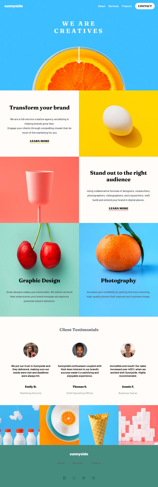

# Frontend Mentor - Sunnyside agency landing page solution

This is a solution to the [Sunnyside agency landing page challenge on Frontend Mentor](https://www.frontendmentor.io/challenges/sunnyside-agency-landing-page-7yVs3B6ef). Frontend Mentor challenges help you improve your coding skills by building realistic projects.

## Table of contents

- [Overview](#overview)
  - [The challenge](#the-challenge)
  - [Screenshot](#screenshot)
  - [Links](#links)
- [My process](#my-process)
  - [Built with](#built-with)
  - [What I learned](#what-i-learned)
  - [Continued development](#continued-development)
- [Author](#author)

## Overview

### The challenge

Users should be able to:

- View the optimal layout for the site depending on their device's screen size
- See hover states for all interactive elements on the page

### Screenshot



### Links

- Solution URL: [Add solution URL here](https://your-solution-url.com)
- Live Site URL: [Add live site URL here](https://your-live-site-url.com)

## My process

### Built with

- Semantic HTML5 markup
- CSS custom properties
- Flexbox
- Mobile-first workflow


### What I learned

Building this design has helped me alot in learning some css properties and selectors i found somewhat difficult at first. A good example is the the css 'last-of-type' and '::after' selector. i also learnt how important it is to first implement the mobile version of a website before proceeding to design the desktop version.

```html
<div class="specialty specialtyOne">
  
  <div class="text">
    <h1>Transform your brand</h1>
    <p>We are a full-service creative agency secializing in helping brands grow fast.</p>
    <p>Engage your clients through compelling visuals that do most of the marketing for you</p>
    <a href="#">Learn more</a>
  </div>
</div>
```

```css
p:last-of-type::after {
  content: "";
  display: block;
  margin-top: 30px;
}
```

### Continued development

This project helped me alot in the aspect of learning sass and i would like gain more knowledge on the implementation of sass and also to sharpen my knowledge on css flexbox as well as how to make use of it to create cutting edge web designs.

## Author

- Frontend Mentor - [@mikester380](https://www.frontendmentor.io/profile/mikester380)
- Twitter - [@boyyarome](https://www.twitter.com/boyyarome)
